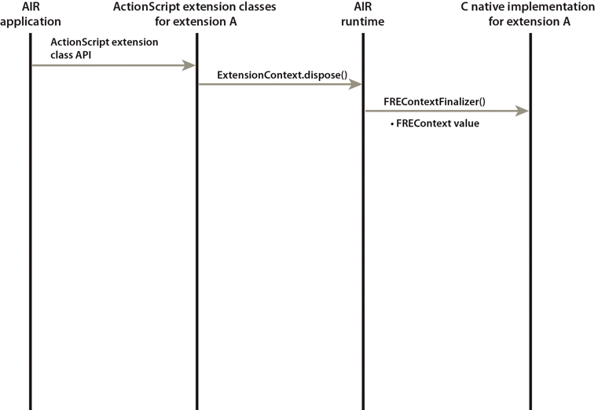

# Extension context finalization

The ActionScript side of your extension can call the `dispose()` method of an
ExtensionContext instance. Calling `dispose(`) causes the runtime to call the
context finalization function of your extension. Define your extension context
finalization function with the signature of
[FREContextFinalizer()](../native-c-api-reference/functions-you-implement/frecontextfinalizer.md).

This method has one input parameter: the FREContext value. You can pass this
FREContext value to `FREGetContextNativeData()` and
`FREGetContextActionScriptData()` to access the context-specific data. Clean up
any data and resources associated with this context.

If the ActionScript side does not call `dispose()`, the runtime garbage
collector disposes of the ExtensionContext instance when no more references to
it exist. At that time, the runtime calls your context finalization function.

The following sequence diagram shows the AIR runtime calling the
`FREContextFinalizer()` function:

Extension context finalization sequence
