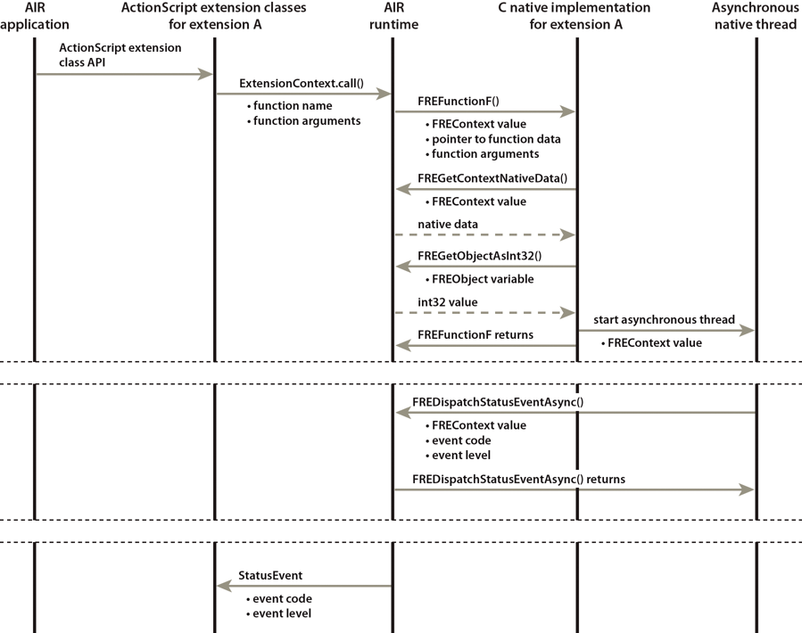

# Extension functions

The ActionScript side of your extension calls C functions you implement by
calling the ExtensionContext instance's `call()` method. The `call()` method
takes these parameters:

- The name of the function. You provided this name in an output parameter of
  your context initialization function. This name is an arbitrary string agreed
  to between the ActionScript side and the native side. Typically, it is the
  same name as the actual name of the native C function. However, these names
  can be different because the runtime associates the arbitrary name with the
  actual function.

- A list of arguments for the native function. These arguments can be any
  ActionScript objects: primitive types or ActionScript class objects.

Define each of your native functions with the same function signature:
[FREFunction()](../native-c-api-reference/functions-you-implement/frefunction.md).
The runtime passes the following parameters to each native function:

- The FREContext value. The native function can use this value to access and set
  the context-specific data. Also, the native implementation uses the FREContext
  value to dispatch an asynchronous event back to the ActionScript side.

- A pointer to the data associated with the function. This data is any native
  data. When the runtime calls the native function, it passes the function this
  data pointer.

- The number of function parameters.

- The function parameters. Each function parameter has the type FREObject. These
  parameters correspond to ActionScript class objects or primitive data types.

A native function also has a return value with the type FREObject. The runtime
returns the corresponding ActionScript object as the return value for the
ExtensionContext `call()` method.

> Note: Do not set a native function's visibility to hidden. Use the default
> visibility.

The following sequence diagram shows an AIR application making a function call
that results in calling a native C function named `FREFunctionF()`. In this
example, the C function:

- Gets the context-specific native data.

- Gets the int32 value of an ActionScript object.

- Starts an asynchronous thread which later dispatches an event.

> Note: The behavior of the C function `FREFunctionF()` is only a sample
> behavior to illustrate a call sequence.

Native function sample call sequence
