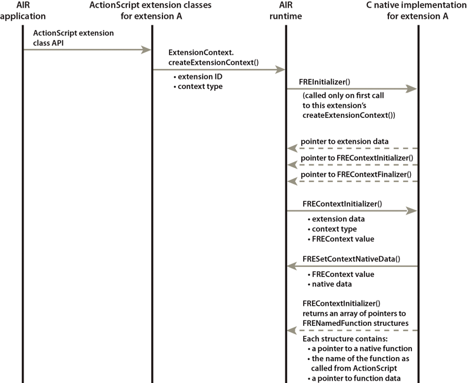

# Extension initialization

The runtime calls an extension initialization function on the native side. The
runtime calls this initialization function once each time the application that
uses the extension runs. Specifically, the runtime calls the initialization
function the first time the extension calls
`ExtensionContext.createExtensionContext()` for any context.

The function initializes data that all extension contexts can use. Define your
extension initializer function with the signature of
[FREInitializer()](../native-c-api-reference/functions-you-implement/freinitializer.md).

For example:

    void MyExtensionInitializer
    (void** extDataToSet, FREContextInitializer* ctxInitializerToSet,
     FREContextFinalizer* ctxFinalizerToSet)
    {
        extDataToSet = NULL;  // This example does not use any extension data.
        *ctxInitializerToSet = &MyContextInitializer;
        *ctxFinalizerToSet = &MyContextFinalizer;
    }

The `FREInitializer()` method that you define returns the following data to the
runtime:

- A pointer to the data that the runtime later passes to each new extension
  context. For example, if all extension contexts use the same utility library,
  this data can include a pointer to the library. This data is called the
  _extension data_ .

  The extension data can be any data you choose. It can be a simple primitive
  data type, or a pointer to a structure you define. In this example, the
  pointer is `NULL` because the extension does not have a use for this data.

- A pointer to the context initialization function. Each time the ActionScript
  side calls `ExtensionContext.createExtensionContext()`, the runtime calls an
  extension context initialization function that you provide. See
  [FREContextInitializer()](../native-c-api-reference/functions-you-implement/frecontextinitializer.md).

- A pointer to the context finalizer function. The runtime calls this function
  when the runtime disposes of the extension context. This call occurs when the
  ActionScript side calls the ExtensionContext instance's `dispose()` method. If
  `dispose()` is not called, the runtime garbage collects the ExtensionContext
  instance. See
  [FREContextFinalizer()](../native-c-api-reference/functions-you-implement/frecontextfinalizer.md).

For application-bundled extensions, your implementation of `FREInitializer()`
can have any name. Specify the name of the initialization function in the
extension descriptor file. See
[Native extension descriptor files](../native-extension-descriptor-files.md).

For device-bundled applications, how to specify the extension initializer
function is device-dependent.

The following sequence diagram shows the AIR runtime calling the
FREInitializer() function. It also shows context initialization. For more
information, see
[Extension context initialization](./extension-context-initialization.md).

Extension initialization sequence
