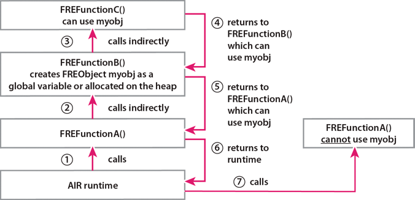

# The FREObject type

A variable of type FREObject refers to an object that corresponds to an
ActionScript class object or primitive type. You use an FREObject variable in
your native implementation to work with ActionScript data. A primary use of the
FREObject type is for native function parameters and return values.

When you write a native function, you decide on the order of the parameters.
Since you also write the ActionScript side, you use that parameter order in the
ExtensionContext instance's `call()` method. Therefore, although every native
function parameter is an FREObject variable, you know its corresponding
ActionScript type.

Similarly you decide on the ActionScript type of the return value, if any, of a
native function. The `call()` method returns an object of this type. Although
the native function return value is always an FREObject variable, you know its
corresponding ActionScript type.

The extensions C API provides functions for using the object that an FREObject
variable refers to. Because these objects correspond to ActionScript data, these
C API functions are how you access an ActionScript class object or primitive
data variable. The C APIs that you use depend on the type of the ActionScript
object. The types are the following:

- An ActionScript primitive data type

- An ActionScript class object

- An ActionScript String object

- An ActionScript Array or Vector class object

- An ActionScript ByteArray class object

- An ActionScript BitmapData class object

> Note: You can call the extensions C APIs only from the same thread as the one
> in which the FREFunction function is running. The one exception is the C API
> for dispatching an event to the ActionScript side. You can call that function,
> `FREDispatchStatusEventAsync()`, from any thread.

## Determining the type of an FREObject variable

Sometimes you don't know the type of ActionScript Object that an FREObject
variable corresponds to. To determine the type, use the C API function
[FREGetObjectType()](../native-c-api-reference/functions-you-use/fregetobjecttype.md):

    FREResult FREGetObjectType( FREObject object, FREObjectType *objectType );

Once you know the type, use the appropriate C APIs to work with the value. For
example if the type is `FRE_TYPE_VECTOR`, use the C APIs in
[Working with ActionScript Array and Vector objects](./working-with-actionscript-primitive-types-and-objects/working-with-actionscript-array-and-vector-objects.md)
to work with the Vector object.

## FREObject validity

If you attempt to use an invalid FREObject variable in a C API call, the C API
returns an `FRE_INVALID_OBJECT` return value.

Any FREObject variable is valid only until the first FREFunction function on the
call stack returns. The first FREFunction function on the call stack function is
the one that the runtime calls due to the ActionScript side calling the
ExtensionContext instance's `call()` method.

The following illustration illustrates this behavior:

FREObject validity on the call stack

> Note: An FREFunction function can indirectly call another FREFunction
> function. For example, `FREFunctionA()` can call a method of an ActionScript
> object. That method then can call `FREFunctionB()`.

Therefore, when using an FREObject variable, consider the following:

- Any FREObject variable passed to an FREFunction function is valid only until
  the first FREFunction function on the call stack returns.

- Any FREObject variable that any native function creates using the extensions C
  API is valid only until the first FREFunction function on the call stack
  returns.

- You cannot use an FREObject variable in another thread. Only use the FREObject
  variable in the same thread as the native function that received or created
  the variable.

- You cannot save an FREObject variable, for example in global data, between
  calls to FREFunction functions. Because the variable becomes invalid when the
  first FREFunction function on the call stack returns, the saved variable is
  useless. However, you can save the corresponding ActionScript object by using
  the method
  [FRESetContextActionScriptData()](../native-c-api-reference/functions-you-use/fresetcontextactionscriptdata.md).

- After an FREObject variable becomes invalid, the corresponding ActionScript
  object can still exist. For example, if an FREObject variable is a return
  value of an FREFunction function, its corresponding ActionScript object is
  still referenced. However, once the ActionScript side deletes its references,
  the runtime disposes of the ActionScript object.

- You cannot share FREObject variables between extensions.

  > Note: You can share FREObject variables between extension contexts of the
  > same extension. However, as in any case, the FREObject variable becomes
  > invalid when the first FREFunction function on the call stack returns to the
  > runtime.
