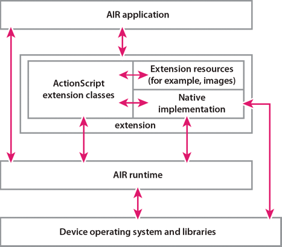

# Native extensions architecture

## Architecture overview

AIR allows an extension to do the following:

- Call functions implemented in native code from ActionScript.

- Share data between ActionScript and the native code.

- Dispatch events from the native code to ActionScript.

When you create a native extension, you provide the following:

- ActionScript extension classes that you define. These ActionScript classes use
  the built-in ActionScript APIs that allow access to and data exchange with
  native code.

- A native code implementation. The native code uses native code APIs that allow
  access to and data exchange with your ActionScript extension classes.

- Resources, such as images, that the ActionScript extension class or the native
  code uses.

Your native extension can target multiple platforms. When it does, you can
provide a different set of ActionScript extension classes and a different native
code implementation for each target platform. For more information, see
[Targeting multiple platforms](#targeting-multiple-platforms).

The following illustration shows the interactions between the native extension,
the AIR runtime, and the device.

Native extension architecture

## Native code programming languages

Adobe AIR provides native code APIs that your native code implementation uses
for interacting with the ActionScript extension classes. These APIs are
available in:

- the C programming language.

- Java

Your native code implementation uses either the C APIs or the Java APIs, but not
both, for interacting with the ActionScript extension classes. However, the rest
of your native code implementation does not have to exclusively use the same
language as the APIs. For example, a developer using the C API can also use:

- C++

- Objective-C

- assembler code to take advantage of highly optimized routines

The following table shows which extension API to use depending on the target
device:

<table>
<colgroup>
<col style="width: 50%" />
<col style="width: 50%" />
</colgroup>
<thead>
<tr class="header">
<th>
Device
</th>
<th>
Native code API to use
</th>
</tr>
</thead>
<tbody>
<tr class="odd">
<td>
Android devices
</td>
<td>
Java API with the Android SDK.

C API with the Android NDK.
</td>
</tr>
<tr class="even">
<td>
iOS devices
</td>
<td>
C API
</td>
</tr>
<tr class="odd">
<td>
Blackberry PlayBook
</td>
<td>
C API
</td>
</tr>
<tr class="even">
<td>
Windows desktop devices
</td>
<td>
C API
</td>
</tr>
<tr class="odd">
<td>
Mac OS X desktop devices
</td>
<td>
C API
</td>
</tr>
</tbody>
</table>

## Targeting multiple platforms

A native extension often targets multiple platforms. For example, an extension
can target devices running iOS and devices running Android. In this case, your
ActionScript class implementation and your native code implementation, including
the native code language, can vary based on the target platform.

A best practice is for your ActionScript extension classes to provide the same
ActionScript public interfaces regardless of their implementation. By keeping
the public interfaces the same, you have a true cross-platform native extension.
If the ActionScript public interfaces are the same, but the ActionScript
implementation is different, you create a different ActionScript library for
each platform.

You can also create extensions that do not have a native code implementation for
some target platforms. Such an extension is useful in the following situations:

- When only some target platforms support a native implementation of the desired
  functionality.

  An extension can use a native implementation on those platforms, but use an
  ActionScript-only implementation on other platforms. For example, consider one
  platform that provides a specialized mechanism for communication between
  computer processes. The extension for that platform has a native
  implementation. The same extension for another platform is ActionScript-only,
  using ActionScript Socket classes.

  When application developers use the extension, they can write one application
  without knowing how the extension is implemented on the different target
  platforms.

- When testing an extension.

  Consider a native extension that uses a specific feature of a mobile device.
  You can create an ActionScript-only extension for the desktop. Then, an
  application developer can use the desktop extension for simulation testing
  during development before testing on the real target device. Similarly, as an
  extension developer, you can test the ActionScript side of your extension
  before involving your native code implementation.

When you publish an extension, you specify the target platforms in an extension
descriptor file in a `<platform>` element. Each `<platform>` element names a
target, such as `iPhone-ARM` or `Windows-x86.` You can also specify a
`<platform>` element named `default`. The `default` platform has an
ActionScript-only implementation to use on all platforms not specified with a
`<platform>` element. For more information, see
[Native extension descriptor files](../native-extension-descriptor-files.md).

> **Note:** The implementation for at least one targeted platform must contain
> native code. If no targeted platforms require native code, then using native
> extensions is not the correct choice. In such cases, create a SWC library.

## Extension availability at runtime

A native extension is available at runtime to an application in one of the
following ways:

Application-bundling  
The extension is packaged with the AIR application, and installed with the
application onto the target device. An extension package typically contains the
native and ActionScript implementations for multiple platforms, but can contain
only one platform's native and ActionScript implementations. Sometimes the
extension package also contains an ActionScript-only implementation for
unsupported platforms or for test platforms.

Device-bundling  
The extension is installed independently of any AIR application in a directory
on the target device. To use device-bundling, you typically work with the device
manufacturer to install the extension on the device.

The following table shows which devices support application-bundling and
device-bundling:

|                     | Application-bundling | Device bundling |
| ------------------- | -------------------- | --------------- |
| Android             | Yes                  | No              |
| iOS                 | Yes                  | No              |
| Blackberry PlayBook | Yes                  | Yes             |
| Windows             | Yes                  | No              |
| Mac OS X            | Yes                  | No              |

## Extension contexts

A native extension is loaded once each time an application runs. However, to use
the native implementation, the ActionScript part of your extension calls a
special ActionScript API to create an _extension context_.

A native extension can do either of the following.

- Create only one extension context.

  Only one extension context is typical for a simpler extension that provides
  only one set of functions in the native implementation.

- Create multiple extension contexts that co-exist.

  Multiple extension contexts are useful to associate ActionScript objects with
  native objects. Each association between an ActionScript object and a native
  object is one extension context instance. These extension context instances
  can have different context types. The native implementation can provide a
  different set of functions for each context type.

Each extension context can have context-specific data that you define and use in
your native implementation.

An extension context can only be created by the ActionScript code in an
extension. It cannot be created by the native code or by the application code.
