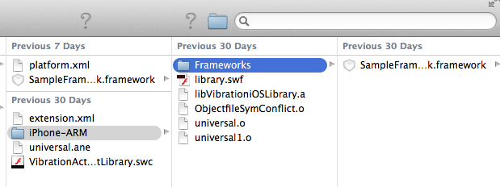

# Building the native library

To build your extension's native library, use a development environment
appropriate for the target device. For example:

- When developing with the Android SDK, use the Android Development tools
  plug-in for the Eclipse Integrated Development Environment (IDE).

- When developing for iOS devices and Mac OS X devices, use Apple's Xcode IDE.

- When developing for Windows devices, you can use Microsoft Visual Studio.

For native extension examples using these development environments, see
[Native extensions for Adobe AIR](https://web.archive.org/web/20160406203944/https://www.adobe.com/devnet/air/native-extensions-for-air.html).

Build the native side of your extension into a library, not an application. When
you package your native extension into an ANE file, you specify the native
library.

## Android native libraries

When you use the Android SDK, provide the library as a JAR file.

When you use the Android NDK, provide a shared library with a filename as
follows:

    lib<yourlibraryname>.so

This shared library naming convention is required for the application APK
package to install correctly.

When you create an ANE package containing shared libraries, the libraries must
be stored in the following directory structure:

    <Android platform directory>/
            libs/
            armeabi/
            <Android emulator native libraries>
            armeabi-v7a/
            <Android device native libraries>

## iOS native libraries

Provide a static library with the .a filename extension. You can use the Cocoa
Touch static library template in the Xcode IDE to build a .a file. Use the
target type _device_ to create a native library that runs on the device; use the
target type _simulator_ to create a native library that runs onthe iOS Simulator
(iOS Simulator support in AIR 3.3 and higher).

Each version of AIR bundles a version of the iOS SDK with it. You can link to
any of the public frameworks available in that version of the iOS SDK in a
native extension that targets the corresponding AIR Version. The following table
lists AIR SDK versions and their bundled iOSs versions, as well as support for
additional features:

| AIR SDK   | Included iOS SDK | link to additional libraries | bundle third-party libraries |
| --------- | ---------------- | ---------------------------- | ---------------------------- |
| 3.0 - 3.2 | 4.2              | no                           | no                           |
| 3.3 - 3.4 | 5.1              | yes                          | no                           |
| 3.5       | 6.0              | yes                          | yes                          |

When targetting a specific AIR SDK version with your extension, you should not
use any iOS frameworks introduced after the corresponding iOS version. Unless
the AIR SDK you're targetting , you should not use any other shared libraries or
third-party frameworks.

As an alternative to using the iOS SDK that's bundled with the AIR SDK, in AIR
3.3 and later you can link to an external iOS SDK. Use the ADT `-platformsdk`
switch, specifying the path to the external iOS SDK.

AIR links to the following iOS framework libraries by default:

|                |                    |                     |
| -------------- | ------------------ | ------------------- |
| AudioToolbox   | CoreLocation       | OpenGLES            |
| AVFoundation   | CoreMedia          | QuartzCore          |
| CFNetwork      | CoreVideo          | Security            |
| CoreFoundation | Foundation         | SystemConfiguration |
| CoreGraphics   | MobileCoreServices | UIKit               |
| GameController | AssetsLibrary      |                     |

When linking to other frameworks and libraries, specify the linkage options in a
platform options XML file.

> Note: In AIR 3.4 and later, you can use the `ADT ‑hideAneSymbols yes` option
> to eliminate potential symbol conflicts. For more information, see
> [Native extension options](https://web.archive.org/web/20220814032009/https://help.adobe.com/en_US/air/build/WS901d38e593cd1bac1e63e3d128fc240122-7ff0.html).

### iOS platform options (platform.xml) file

You can use a platform options (platform.xml) file to specify iOS-specific
options for linking to additional frameworks and libraries or for bundling
third-party frameworks or libraries in your native extension. The platform
options file is added to the ANE when you package the extension by specifying
the `-platformoptions` flag after the `-platform` flag for iOS. Later, when a
developer creates an application IPA file that uses your extension, ADT uses the
options in the platform.xml file to link to the additional libraries and include
the bundled dependencies.

> Note: The platform options file can have any name. You are not required to
> name it "platform.xml."

You can use an iOS platform options file with both the iPhone-ARM (device) and
iPhone-x86 (iOS simulator) platforms.

Platform options files require AIR 3.1 or later.

When using the _packagedDependencies_ feature for packaging the ANE for iOS, add

    <option>-rpath @executable_path/Frameworks</option>

inside the `linkerOptions` tag, in _platformoptions.xml_.

#### iOS linker options

The iOS linker options provides a way for you to pass arbitrary options to the
linker. The specified options are passed unchanged to the linker. You can use
this to link to additional frameworks and libraries, such as additional iOS
frameworks. To specify linker options, use the `<linkerOptions>` tag in the
platform options xml file. Inside the `<linkerOptions>` tag, specify each
linkage option wrapped in an `<options>` tag pair, as shown in the following
example:

    <linkerOptions>
        <option>-ios_version_min 5.0</option>
        <option>-framework Accelerate</option>
        <option>-liconv</option>
    </linkerOptions>

Any dependency linked in this way must be distributed to developers who use your
native extension separate from the native extension itself. This is most useful
for using an additional library included with iOS but not linked by AIR by
default. You can also use this option to allow developers to link to a static
library that you provide them separately.

The `<linkerOptions>` tag requires AIR 3.3 or later.

#### Packaged third-party dependencies

In some cases you want to use a static library (for example, a native
third-party library) in your native extension without having access to the
source code for the library, or without requiring developers to have access to
the library separate from your extension. You can bundle the static library with
your native extension by specifying it as a packaged dependency. Use the
`<packagedDependencies>` tag in the platform options xml file. For each
dependency that you want to include in the extension package, specify its name
or relative path surrounded in a `<packagedDependency>` tag pair, as shown in
the following example:

    <packagedDependencies>
        <packagedDependency>foo.a</packagedDependency>
        <packagedDependency>abc/x.framework</packagedDependency>
        <packagedDependency>lib.o</packagedDependency>
    </packagedDependencies>

A packaged dependency should be a static library with one of the following
extensions: `.a`, `.framework`, or `.o`. The library should support the ARMv7
architecture to be used on a device, and the i386 architecture for use with the
iOS simulator.

When packaging the native extension, you must specify the names of the
dependencies as parameters to the `-platformoptions` flag. List the dependencies
after the filename of the platform.xml file and before any following `-package`
flag, as shown in the following example:

    adt -package <signing options> -target ane MyExtension.ane MyExt.xml -swc MyExtension.swc
                                -platform iPhone-ARM -platformoptions platformiOSARM.xml
                                foo.a abc/x.framework lib.o -C platform/ios .
                                -platform iPhone-x86 -platformoptions platformiOSx86.xml
                                -C platform/iosSimulator
                                -platform default -C platform/default library.swf

The `<packagedDependencies>` tag requires AIR 3.5 or later.

#### Using private embebbed frameworks

To create iOS ANEs with Xcode6 or later, using private frameworks:

1.  Edit platform.xml to add

        <option>-rpath @executable_path/Frameworks</option>

    inside the the `linkerOptions` tag.

    For example,

        </description>
                                            <linkerOptions>
                                            <option>-ios_version_min 5.1.1</option>
                                            <option>-rpath @executable_path/Frameworks</option>
                                            </linkerOptions>
                                            <packagedDependencies>
                                            <packagedDependency>SampleFramework.framework</packagedDependency>
                                            </packagedDependencies>

2.  Create a folder named, Frameworks, inside the existing iPhone-ARM folder .

3.  Copy the private framework to the Frameworks folder and package the
    framework with the ANE.

    

    Copy private framework

#### Platform options (platform.xml) file example

The following listing shows an example of the structure of a platform options
(platform.xml) file:

    <platform xmlns="http://ns.adobe.com/air/extension/3.5">
        <description>An optional description.</description>
        <copyright>2011 (optional)</copyright>
        <sdkVersion>5.0.0</sdkVersion>
        <linkerOptions>
            <option>-ios_version_min 5.0</option>
            <option>-framework Accelerate</option>
            <option>-liconv</option>
        </linkerOptions>
        <packagedDependencies>
            <packagedDependency>foo.a</packagedDependency>
            <packagedDependency>abc/x.framework</packagedDependency>
            <packagedDependency>lib.o</packagedDependency>
        </packagedDependencies>
    </platform>

To include this platform options file in the native extension package, you can
use an ADT command such as the following:

    adt -package <signing options> -target ane MyExtension.ane MyExt.xml -swc MyExtension.swc
                                -platform iPhone-ARM -platformoptions platformiOSARM.xml
                                foo.a abc/x.framework lib.o -C platform/ios .
                                -platform iPhone-x86 -platformoptions platformiOSx86.xml
                                -C platform/iosSimulator
                                -platform default -C platform/default library.swf

## Mac OS X native libraries

For Mac OS X devices, provide a .framework library. When building the library,
make sure that the Xcode project's setting for the base SDK is the Mac OS X 10.5
SDK.

When compiling Mac OS X frameworks for use as an extension, set the following
options to support correct resolution of the dependency on the AIR framework in
all scenarios:

- Add `@executable_path/../runtimes/air/mac`, `@executable_path/../Frameworks`,
  and `/Library/Frameworks` to LD_RUNPATH_SEARCH_PATHS.

- Use weak framework linking and the flat namespace option.

Together, these option settings allow the application to load the correct copy
of the AIR framework first, and then for the extension to rely on the already
loaded copy.

## Windows native libraries

For Windows devices, provide the library as a DLL file. Dynamically link the
library FlashExtensions.lib, located in the AIR SDK directory in the lib/windows
directory, into your DLL. Also, if your native code library uses any of
Microsoft's C runtime libraries, link to the multi-thread, static version of the
C runtime library. To specify this type of linking, use the /MT compiler option.
